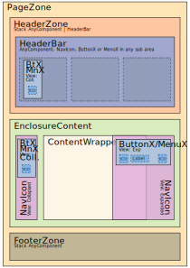
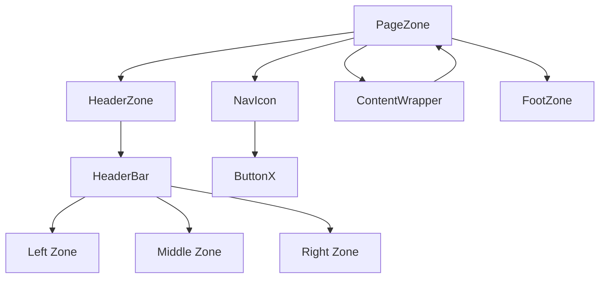

# 🗂️ Documentação de Layout e Componentes UI



## 🔷 Arquitetura Geral

Toda a interface é composta pelo componente raiz `PageZone`.

O `PageZone` pode conter os seguintes subcomponentes:

- `[1] HeaderZone` (máximo 1)
- `[2] NavIcon` (máximo 2)
- `[3] FootZone` (máximo 1)
- `[4] ContentWrapper` (máximo 1, permite nesting infinito de `PageZone`)

### 📜 Layout em texto

```
[PageZone]
 ├── [HeaderZone]
 │     ├── [HeaderBar]
 │     │     ├── [LeftZone]
 │     │     ├── [MiddleZone]
 │     │     ├── [RightZone]
 │     └── ...
 ├── [NavIcon] (esquerda ou direita, até 2)
 ├── [ContentWrapper]
 │     ├── [PageZone] (opcional, máximo 1; permite PageZone nesting)
 │     └── [*]
 └── [FootZone] (opcional)
       └── [*]
```

## 🔹 Componentes Principais

### `[0] PageZone`

> Contêiner pai da interface.

**Comporta:**

- Até 1 `HeaderZone`
- Até 2 `NavIcon` (horizontal ou vertical)
- Até 1 `FootZone`
- Até 1 `ContentWrapper` (que pode conter outro `PageZone` recursivamente)

#### 🧩 Fluxograma de Composição



### `[1] HeaderZone`

> Área de cabeçalho.

- Lista empilhável verticalmente de `HeaderBar`.
- Altura dinâmica, conforme conteúdo.

### `HeaderBar`

> Cabeçalho horizontal com 3 zonas:

- **Left:** alinhado à esquerda.
- **Middle:** ocupa o centro (conteúdo centralizado, à esquerda ou direita).
- **Right:** alinhado à direita.

**Funcionalidades:**

- Suporta `NavIcon` (horizontal) em qualquer zona.
- Suporta qualquer outro componente (`*`) exceto PageZone.
- Pode ser "**sempre visível**", fixando no topo ao rolar, sem alterar o scroll.
- Múltiplos `HeaderBar` fixados se empilham na ordem.
- Overflow tratado via submenus, sem scroll horizontal.

#### 📐 Distribuição Interna (Flat View)

```
[LeftZone] [MiddleZone] [RightZone]
```

---

### `[2] NavIcon`

> Barra de ferramentas (`ButtonX`), com modos:

- **Vertical:** fixa ou flutuante, expansível/retrátil (aumenta largura).
- **Horizontal:** não muda largura, mas ajusta o layout dos botões.

#### 📐 Modos de largura no Horizontal

- `100%` do espaço disponível.
- Largura fixa (mas responsiva).
- Largura mínima necessária.

#### 📐 Overflow

- Nunca usa scrollbar → cria submenus ou colapsa.

---

### `[3] FootZone`

> Área de rodapé.

- Idêntica ao `ContentWrapper`.
- Pode conter qualquer outro componente (`*`) exceto PageZone.

---

### `[4] ContentWrapper`

> Área de conteúdo principal.

- Aceita qualquer componente (`*`), inclusive outro `PageZone` (nesting infinito).

---

## 🔘 Componente Auxiliar

### `ButtonX`

> Botão genérico, responsivo e customizável.

#### 📐 Estrutura Interna

```
[LeftIcon]? [Caption]? [RightIcon]?
```

- `RightIcon` só aparece se `Caption` estiver presente.

#### 📐 Alinhamento

- `LeftIcon` + `Caption` → esquerda (padrão) ou centralizado (opcional).
- Apenas `LeftIcon` → centralizado.
- `RightIcon` → sempre à direita.

#### 📐 Modos de layout

- **Inline:** ocupa o espaço necessário.
- **Full:** todos os irmãos com mesma largura (fixa ou baseada no maior).

**Compatível com expansão de `NavIcon`.**

---

## MenuX

> Extende Button

#### 📐 Estrutura Interna

```
<input> [ButtonX] [NavIcon]
```

---

## 🔧 Animações e Estados

- Totalmente CSS/SCSS/DaisyUI.
- Transições suaves e rápidas.
- Estados controlados via CSS puro (`input`, `:checked`, `:has`, `data-*`, `:focus`,...).
- Sem uso de JS para estilos/animações/efeitos (salvo quando impossível por CSS).

---

## 🔍 Overflow

- `HeaderBar` e `NavIcon` **não usam scroll**.
- Overflow tratado com submenus ou agrupamentos de forma automática.

## Icones

- Font: fontawesome, incluindo brands, regular e solids.
- Uso de @fortawesome/react-fontawesome;
- Se ícone fornecido como string: interprete para lidar corretamente, mas emita logger.warn.

---

## ✔️ Regras Gerais

- Todos os componentes permitem sobrescrever estilos (DaisyUI ou classes).
- `ContentWrapper` e `FootZone` aceitam qualquer componente (`*`).
- Layout otimizado para modularidade, performance e clareza de estados.
- Os componentes devem remover duplicidade e conflitos de estilos (DaisyUI ou classes);
- Projeto base:
  - DaisyUI;
  - tailwind-merge;
  - tailwind-variants;
  - clsx;
  - tsx;
  - PeacJS
  - vite
