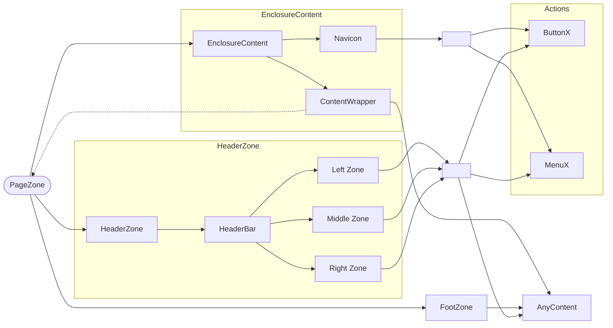

# 🗂️ Documentação de Layout e Componentes UI


## 🔷 Arquitetura Geral

### Componentes

- ButtonX
- ContentWrapper
- EnclosureContent
- FooterZone
- HeaderBar
- HeaderZone
- MenuX
- NavIcon

### Hierarquia geral

```
[PageZone]
├── (HeaderZone)  // Pelo menos um destes ↓ deve existir (AnyComponent* ou HeaderBar*)
│     ├── (AnyComponent*) // stack
│     └── (HeaderBar*)  //^2
│           ├── [LeftZone] //^3
│           │     ├── (breadcrumbs*) //^2
│           │     ├── (AnyComponents*) //^2
│           │     └── (ButtonX+/MenuX+)  //^1
│           ├── [MiddleZone] //^3
│           │     ├── (breadcrumbs*) //^2
│           │     ├── (AnyComponents*) //^2
│           │     └── (ButtonX+/MenuX+)  //^1
│           └── [RightZone] //^3
│                 ├── (breadcrumbs*) //^2
│                 ├── (AnyComponents*) //^2
│                 └── (ButtonX+/MenuX+)  //^1
├── EnclosureContent
│   ├── (NavIcon)  // left
│   │     └── [ButtonX+]
│   ├── ContentWrapper   [obrigatório]
│   │    └── (PageZone) ^ [AnyComponent+]  // XOR
│   └── (NavIcon) // right
│         └── [ButtonX+]
└── (FooterZone)
      └── [AnyComponent+]  //#2
```

### Em designer ASCII:

```
+----------------------------------+
| [PageZone]                       |
| ╔══════════════════════════════╗ |
| ║ [HeaderZone]                 ║ |
| ║ • [AnyComponent*] (V)        ║ |
| ║ • [HeaderBar*]:              ║ |
| ║   > [LftZ][MidZ][RgtZ]       ║ |
| ║   >> [ButonX*]/[MenuX*]...   ║ |
| ╚══════════════════════════════╝ |
| ╔══════════════════════════════╗ |
| ║ [EnclosureContent]           ║ |
| ║┌─────┐ +────────────+ ┌─────┐║ |
| ║│[NAV]│ |[ContentWr] │ │[NAV]│║ |
| ║│ •BX │ | •(PageZ)^  │ │ •BX │║ |
| ║│ •BX │ | •[AnyComp+]│ │ •BX │║ |
| ║└─────┘ +────────────+ └─────┘║ |
| ╚══════════════════════════════╝ |
| ╔══════════════════════════════╗ |
| ║ [FooterZone]                 ║ |
| ║ • [AnyComponent+] (V)        ║ |
| ╚══════════════════════════════╝ |
+----------------------------------+
```

### Legenda:

- (A): componente não obrigatório
- [A]: exatamente 1 elemento do tipo A
- [A+]: 1+ elementos (obrigatório)
- [A*]: 0+ elementos (opcional)
- [A/B] ou [A] / [B]: OR (pode ter A, B ou ambos)
- [A^B] ou [A] ^ [B]: XOR (apenas A ou apenas B)
- [AnyComponent]: qualquer componente válido
- [breadcrumbs]: readcrumb navigation, que é um elemento de interface do usuário em sites e aplicativos.
- //#1: ButtonX/MenuX não podem aparecer sequencialmente fora de NavIcon
- //#2: Componentes empilhados verticalmente
- //#3: empilhados horizontalmente - ocupam,juntos, toda a área horizontal

### Fluxograma de Composição



## Desenvolvimento

### 🔍 Overflow

- Nenhum componente **usa scroll**.
- Overflow tratado com submenus ou agrupamentos de forma automática pelo próprio componente.

### Estilos

- Efeitos, Transições suaves e rápidas e totalmente em CSS/DaisyUI.
- Estados controlados via CSS puro (`input`, `:checked`, `:has`, `data-*`, `:focus`,...).

### Icones

- Font: fontawesome, incluindo brands, regular e solids.
- Uso de @fortawesome/react-fontawesome;
- Se ícone fornecido como string: interprete para lidar corretamente, mas emita logger.warn.

### Boas práticas

- Mensagens de log/warn/error via `Logger`
- Manutenção git-friendly (evitar breaking changes)
- Comentários
  - Comentários objetivos para mudanças complexas
  - Comentários de uma única linha são preferíveis, exceto quando para jsDoc
  - Manter a documentação jsDoc do topo do código com ajustes mínimos e pontuais quando necessário
- Todos os componentes permitem sobrescrever estilos (DaisyUI ou classes)
- Acessibilidade (aria-label quando aplicável)
- Performance (zero JS para estado/animações/transições)
- Usa helper `resolveClassName()` para tratamento de classes/DaisyUI - removendo duplicidade e conflitos de estilos (DaisyUI ou classes)
- Layout otimizado para modularidade, performance e clareza de estados

### Projeto base

- DaisyUI
- tailwind-merge
- tailwind-variants
- clsx
- tsx
- PreacJS
- vite
- TypeScript
- @fortawesome/react-fontawesome
